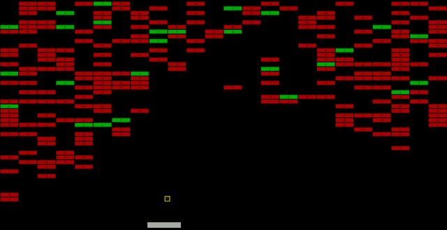

# phaser-breakout

Endless breakout demo made with Phaser 3.

[Play](https://nunof07.github.io/phaser-breakout/dist/)

## Credits

- Music: [Fig Leaf Rag](https://incompetech.com/music/royalty-free/collections.html?collection=8&Search=Search) (Scott Joplin) by Kevin MacLeod. License: [CC-BY 3.0](https://creativecommons.org/licenses/by/3.0/).

## Setup for development

- Clone repository.
- Run `npm install` in project folder.
- Run `npm run info` to see all available scripts.
- Run `npm start` to serve game and watch for changes.